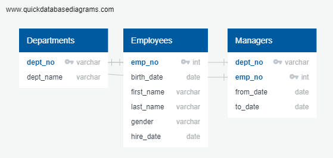

# Pewlett-Hackard-Analysis

### Overview
  
  -This week I am working alongside Bobby who works for Pewlett Hackard and is in need of some help to catch up on a data analysis project. The project includes getting employees data, gathering retirement dates and upcoming retirement for eligible employees, lastly to help find eligible employees to fill roles left by outgoing employees. To visualize what we will be doing during this project I created a Quick DBD to get a grasp of what we will need to grab from and the paths to follow.
  
### Results 
  
  -First we laid out an outline on Quck DBD as shown below. 
  
  
  
  -Second we found and isolated the group of employees retiring, then put that into its own table and exported it as "retiring_titles.csv"
  -After finding which employees were retiring and then positions they held we were able to sort through possible employees to hire from within and promote to said positions so they would not be left with new inexperienced employees. 
  -Lastly after finding that data putting each into its own table and naming them, we exported each table as a csv file to give back to Pewlett Hackard. As a csv file it will be easily readable and formatted once opened in excel as a clean and simplified version of the data to read with specific categories other than just first and last name. 

### Conclusion 

  -After going over the data given, re organising it in SQL and exporting the seperated tables as a csv file I believe Bobby and I hit the target perfectly and gave Pewlett Hackard exactly what they asked, and in a timely matter.  
